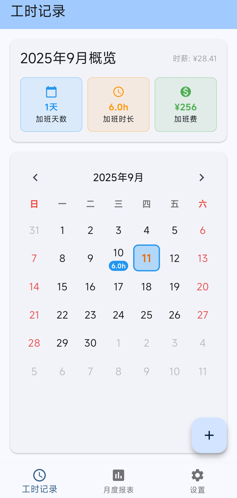
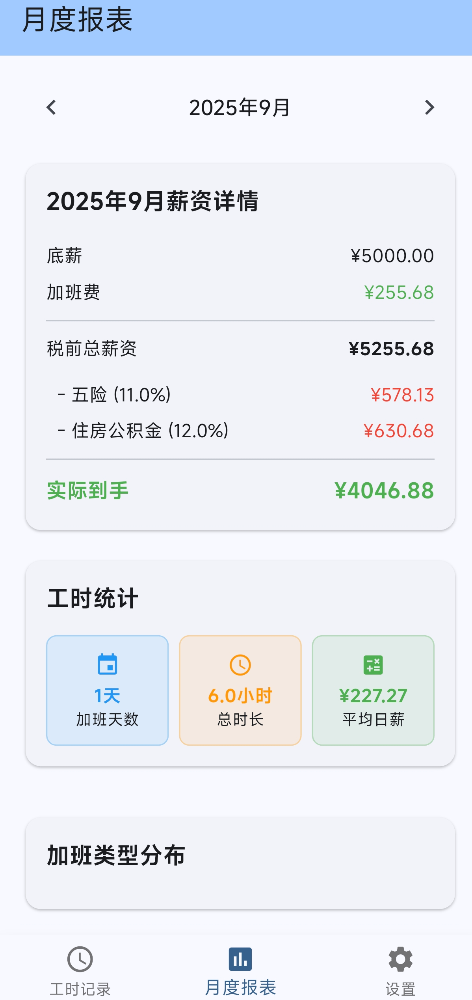
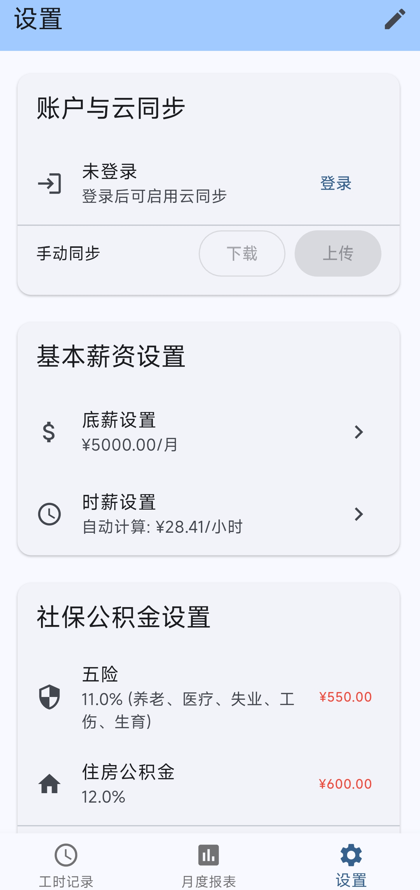

# 📱 加班费计算器 (Overtime Pay Calculator)

一个基于 Flutter 的加班工时与薪资计算应用：记录每日加班、统计月度加班时长与加班费，并计算实际到手工资。支持本地持久化、编辑/删除与去重统计，后续可接入云同步。

## ✨ 项目简介

- 技术栈：Flutter 3.x + Provider（全局 `GlobalData`）+ SharedPreferences 持久化
- 特点：
  - 🗓️ 日历视图记录 + 双击新增
  - ✏️ 直接编辑/删除记录（支持合并同日同类型）
  - 📊 月度报表（加班天数/总时长/类型分布/薪资明细）
  - 🧩 小组件化结构，中文注释齐全

## 🖼️ 界面预览


| 主页（日历） | 月度报表 | 设置 |
| --- | --- | --- |
|  |  |  |

## ✅ 功能介绍

- 🗓️ 日历视图：按月展示每日加班汇总，点击/双击快速新增；点击“时长徽标”可直接编辑/删除当日记录。
- 🧮 合并开关：支持“同日同类型合并记录”选项（默认开启），避免同一天被重复计数；“加班天数”按日期去重统计。
- 📊 月度报表：
  - 薪资明细：底薪 + 加班费 → 扣除五险/公积金 → 到手
  - 工时统计：加班天数（去重）/总时长/平均日薪
  - 类型分布：平时/周末/节假日 三类固定展示
- ⚙️ 设置：底薪、五险、公积金、自定义时薪即时生效；登录占位（邮箱）与云同步接口（默认空实现）。

> 代码结构（节选）
```
lib/
├── main.dart                       # 应用入口（Provider 注入 + 初始化）
├── models/                         # 数据模型与全局状态
├── services/                       # 本地存储/鉴权/云同步接口
├── screens/                        # 页面（Home/Report/Settings）
└── widgets/                        # 通用与领域组件（common/home/report/settings）
```

## 🤝 贡献
**AI 做的，不用贡献**

## 📄 许可证

本项目基于 Apache-2.0 许可证开源，详见 [LICENSE](LICENSE)。

## 🙏 鸣谢


<div align="center">
  
  <br>
  <b>特别感谢 <a href="https://www.jetbrains.com/">JetBrains</a> 为开源项目提供免费的 IDE 授权</b>
</div>
